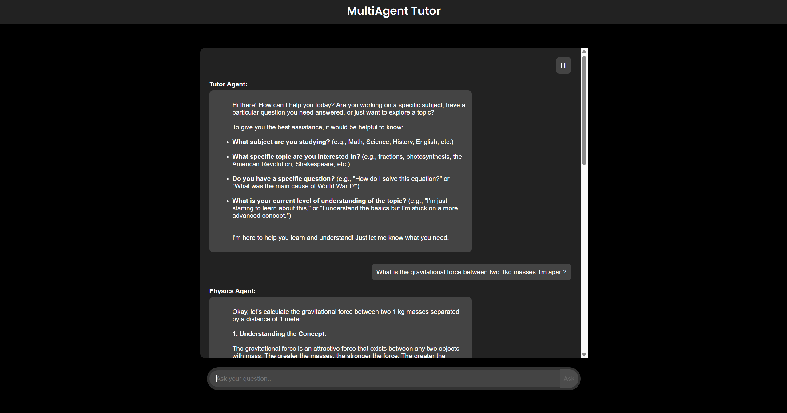
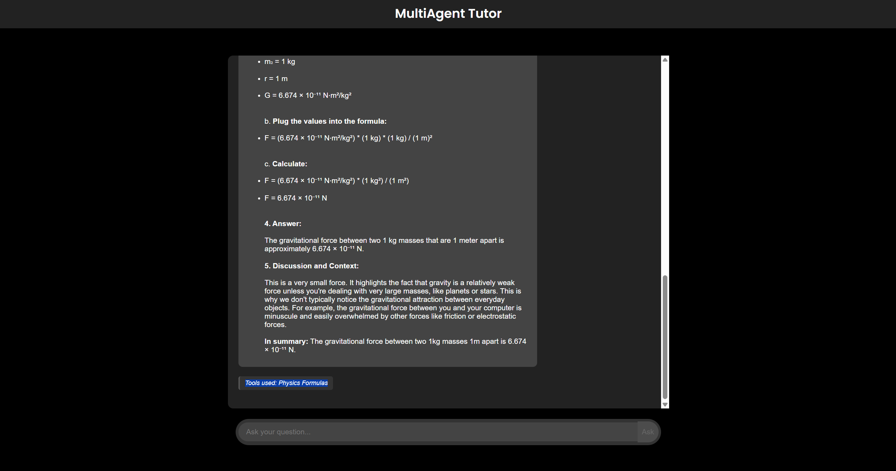

# AI Tutor Multi-Agent System

A multi-agent tutoring system built with FastAPI and Google's Gemini API, following Agent Development Kit (ADK) principles. The system uses a coordinator pattern where a main Tutor Agent routes student questions to specialized sub-agents.

## System Architecture

### Main Components

1. **Tutor Agent** (Coordinator)
   - Routes queries to appropriate specialist agents
   - Uses keyword matching and Gemini API for intent classification
   - Handles general educational queries

2. **Math Agent** (Maths Specialist)
   - Handles mathematics-related questions
   - Uses Calculator Tool for arithmetic operations
   - Provides step-by-step solutions and explanations

3. **Physics Agent** (Physics Specialist)
   - Handles physics-related questions
   - Uses Physics Constants Tool, Unit Converter Tool, and Physics Formula Tool
   - Provides comprehensive physics explanations with unit conversions and formulas

4. **Chemistry Agent** (Chemistry Specialist)
   - Handles chemistry-related questions
   - Uses Periodic Table Tool for element information lookup
   - Provides detailed chemical element data and explanations

### Tools

- **Calculator Tool**: Performs basic arithmetic operations safely
- **Physics Constants Tool**: Provides access to fundamental physics constants
- **Unit Converter Tool**: Converts between different units of measurement
- **Physics Formula Tool**: Provides physics formulas and calculations
- **Periodic Table Tool**: Comprehensive periodic table data with element properties





 


## Installation

1. Clone the repository:
```bash
git clone https://github.com/Mayankrai449/MultiAgentTutor.git
cd MultiAgentTutor
```

2. Install dependencies:
```bash
pip install -r requirements.txt
```

3. Set up environment variables:
```bash
cp .env.example .env
# Edit .env and add your GEMINI_API_KEY
```

4. Get your Gemini API key:
   - Go to [Google AI Studio](https://makersuite.google.com/app/apikey)
   - Create a new API key
   - Add it to your `.env` file

## Usage

### Starting the Server

```bash
uvicorn main:app --reload
```

The server will start on `http://localhost:8000`

### API Endpoints

#### POST /ask
Submit a question to the AI tutor system.

**Request:**
```json
{
  "question": "What is 25 + 17?"
}
```

**Response:**
```json
{
  "answer": "25 + 17 equals 42. This is a basic addition problem...",
  "agent_used": "Math Agent",
  "tools_used": ["Calculator Tool"]
}
```

#### GET /health
Check if the service is running.


### Example Queries

**Math Questions:**
- "What is 25 + 17?"
- "Solve the equation 2x + 5 = 11"
- "Calculate 15 * 8"

**Physics Questions:**
- "What is Newton's second law?"
- "What is the speed of light?"
- "Convert 100 mph to km/h"
- "What is the formula for kinetic energy?"

**Chemistry Questions:**
- "Tell me about hydrogen"
- "What is the atomic mass of carbon?"
- "What elements are in group 18?"
- "Describe the electron configuration of oxygen"

**General Questions:**
- "How do I study effectively?"
- "What is the scientific method?"

## Features

### Multi-Agent Architecture
- **Coordinator Pattern**: Main agent routes queries to specialists
- **Specialization**: Each agent focuses on specific domains (Math, Physics, Chemistry)
- **Modularity**: Easy to add new agents and tools

### Intelligent Routing
- Keyword-based classification for fast routing
- Gemini API fallback for complex classification
- Support for general educational queries

### Comprehensive Tool Integration
- **Calculator Tool**: Safe mathematical expression evaluation
- **Physics Constants Tool**: Comprehensive physics constants database
- **Unit Converter Tool**: Convert between different measurement units
- **Physics Formula Tool**: Access to common physics formulas and calculations
- **Periodic Table Tool**: Complete periodic table with detailed element information including:
  - Atomic number and mass
  - Electron configuration
  - Element properties (group, period, state, category)
  - Descriptive information

### Enhanced Response Format
- Detailed answers with step-by-step explanations
- Information about which agent handled the query
- List of tools used in generating the response


## Deployment

### Local Development
```bash
uvicorn main:app --reload --host 0.0.0.0 --port 8000
```
### Deployed Link
[Deployed Site](https://multiagenttutor.onrender.com)

## Configuration

### Environment Variables
- `GEMINI_API_KEY`: Your Gemini API key (required)

### Model Configuration
The system uses `gemini-2.0-flash-001` by default. You can modify this in the agent files if needed.
